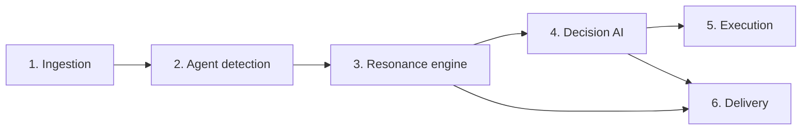

# Architecture

Intent Hybrid is a six-layer pipeline that turns raw on-chain activity into early warnings about liquidation cascades.

## 1. Ingestion
Streams low-latency preconfirmations from a high-performance L2, giving roughly a couple hundred milliseconds of head start over confirmed blocks. Transfers, swaps, and position changes are normalized into one event stream.

## 2. Agent detection
Clusters the event stream into behavioral cohorts: groups of addresses that trade alike (same signals, same timing, similar liquidation thresholds). The output is a live map of who is trading like whom.

## 3. Resonance engine
Collapses cohort crowding into a single Resonance Index from 0 to 100. See [RESONANCE.md](./RESONANCE.md) for the methodology.

## 4. Decision AI
A model is woken only when the index crosses a threshold, so compute is spent on real risk instead of noise. It classifies the situation (Monitor / Warn / Derisk) and produces a rationale and a confidence score.

## 5. Execution (opt-in)
When a user enables Active Protection, the agent acts through scoped session keys with hard limits, routed through a private mempool. No custody, no blanket approvals. See [../SECURITY.md](../SECURITY.md).

## 6. Delivery
Publishes the live index, cohort signals, and alerts over a REST API and a WebSocket feed. See [API.md](./API.md).
